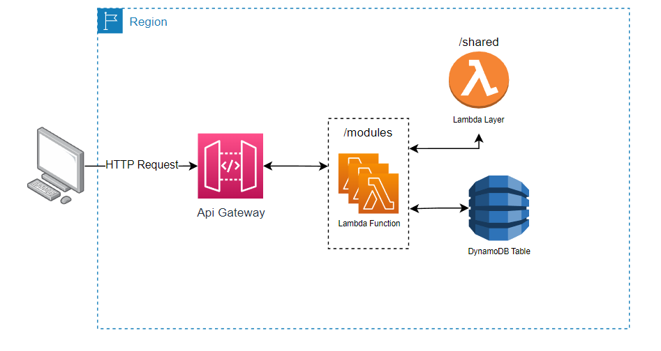

# clean_mss_template 🌡🍽
 
Template for microservices repositories based in Clean Arch

## The Project 📽

### Introduction and Objectives ⁉

The main objective is to provide a template for repositories that can be used as a starting point for new projects. This
architecture is based on the Clean Architecture, and it was based in many other projects and books, articles that were
mixed by the students of Mauá Institute of Technology, from the academic group Dev. Community Mauá.

### Reasons 1️⃣3️⃣

The project aims to help developers to start new projects with a good architecture, and with a good structure, so that anybody can create good applications.

### Clean Architecture 🧼🏰

The purpose of the project is to learn and create a Clean Architecture for microservices stateless with AWS Lambda which is a way of structuring
the code in layers, each of which has a
specific responsibility. This architecture is based on the principles of SOLID and books like "Clean Architecture: A
Craftsman's Guide to Software Structure and Design" by Robert C. Martin.

We also tried to explain for new programmers in the mos intuitive way and you can see the explanation here: [Clean Architecture Figma](https://www.figma.com/file/CmfQcH2xbZyIszPX0iOxPp/Clean-Arch---HackaBeckas?node-id=0%3A1&t=B38vNfX3VSv6qtU7-1)


### Folder Structure 🎄🌴🌲🌳

Our folder structure was developed specially for our projects. 


```bash
.
├── iac
├── src
│   ├── modules
│   │   ├── create_user
│   │   │   └── app
│   │   ├── delete_user
│   │   │   └── app
│   │   ├── get_user
│   │   │   └── app
│   │   └── update_user
│   │       └── app
│   └── shared
│       ├── domain
│       │   ├── entities
│       │   ├── enums
│       │   └── repositories
│       ├── helpers
│       │   ├── enum
│       │   ├── errors
│       │   ├── functions
│       │   └── http
│       └── infra
│           ├── dto
│           ├── external
│           └── repositories
└── tests
    ├── modules
    │   ├── create_user
    │   │   └── app
    │   ├── delete_user
    │   │   └── app
    │   ├── get_user
    │   │   └── app
    │   └── update_user
    │       └── app
    └── shared
        ├── domain
        │   └── entities
        ├── helpers
        └── infra

```


## Name Format 📛
### Files and Directories 📁

- Files have the same name as the classes
- snake_case 🐍 (ex: `./app/create_user_controller.py`)

### Classes 🕴
- #### Pattern 📟

    - CamelCase 🐫🐪

- #### Types 🧭

    - **Interface** starts with "I" --> `IUserRepository`, `ISelfieRepository` 😀
    - **Repository** have the same name as interface, without the "I" and the type in final (ex: `UserRepositoryMock`, `SelfieRepositoryDynamo`) 🥬
    - **Controller** ends with "Controller" --> `CreateUserController`, `GetSelfieController` 🎮
    - **Usecase** ends with "Usecase" --> `CreateUserUsecase`, `GetSelfieUsecase` 🏠
    - **Viewmodel** ends with "Viewmodel" --> `CreateUserViewmodel`, `GetSelfieViewmodel` 👀
    - **Presenter** ends with "Presenter" --> `CreateUserPresenter`, `GetSelfiePresenter`🎁

### Methods 👨‍🏫

- snake_case 🐍
- Try associate with a verb (ex: `create_user`, `get_user`, `update_selfie`)

### Variables 🅰

- snake_case 🐍
- Avoid verbs

### Enums

- SNAKE_CASE 🐍
- File name ends with "ENUM" (ex: "STATE_ENUM")

### Tests 📄

- snake_case 🐍
- "test" follow by class name (ex: `test_cadastrar_usuario_valido`, `test_cadastrar_usuario_sem_email`)
    - The files must start with "test" to pytest recognition

### Commit 💢

- Start with verb
- Ends with emoji 😎


## Architecture Diagram 🏗



## Installation 👩‍💻

Clone the repository using template

### Create virtual ambient in python (only first time)

###### Windows

    python -m venv venv

###### Linux

    virtualenv -p python3.9 venv

### Activate the venv

###### Windows:

    venv\Scripts\activate

###### Linux:

    source venv/bin/activate

### Install the requirements

    pip install -r requirements-dev.txt

### Run the tests

    pytest

### To run local set .env file

    STAGE = TEST


## Contributors 💰🤝💰

- Bruno Vilardi - [Brvilardi](https://github.com/Brvilardi) 👷‍♂️
- Hector Guerrini - [hectorguerrini](https://github.com/hectorguerrini) 🧙‍♂️
- João Branco - [JoaoVitorBranco](https://github.com/JoaoVitorBranco) 😎
- Vitor Soller - [VgsStudio](https://github.com/VgsStudio) ☀
- Lucas Duez - [Lucasdvs10](https://github.com/Lucasdvs10) 🤡
- Rodrigo Morales - [RodrigoM2004](https://github.com/RodrigoM2004) 🚗
- Lucas Milani - [LucasKiller](https://github.com/LucasKiller) 🔪
- Rafael Rubio - [Rubiozito](https://github.com/Rubiozito) 🎸

## Special Thanks 🙏

- [Dev. Community Mauá](https://www.instagram.com/devcommunitymaua/)
- [Clean Architecture: A Craftsman's Guide to Software Structure and Design](https://www.amazon.com.br/Clean-Architecture-Craftsmans-Software-Structure/dp/0134494164)
- [Institute Mauá of Technology](https://www.maua.br/)


